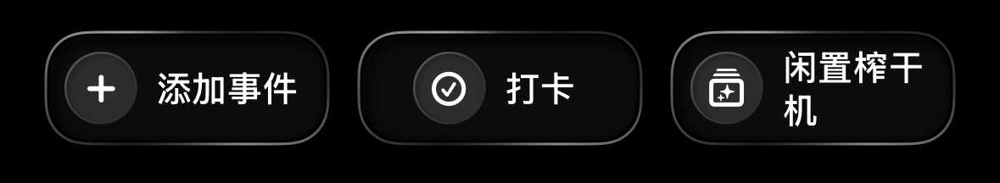

# MaiLeMe 首页中栏动作按钮黑色物理咬合样式

## 效果截图


## 问题
首页中栏按钮不是普通胶囊按钮，而是偏“黑色机械面板”语言：

1. 按钮主体要像咬合在黑色底板里；
2. 边缘要形成连续对角高光；
3. 图标区需要一个低透明的毛玻璃圆坑；
4. 渐变 stop 必须稳定有序，不能再触发 `Gradient stop locations must be ordered.`。

## 实现思路
这套实现拆成两层：

### 1. 统一定义有序的边缘光 stop
先在 `HomeActionBarRimStyle` 中预定义一套升序 stop，
再通过 `startAngle` / `endAngle` 做等效旋转，保证视觉位置不变。

### 2. actionButton 采用“外描边高光 + 深色下陷 + 图标圆坑”三层结构
- 外层：`RoundedRectangle` + `AngularGradient`
- 中层：深色主体 `#0C0C0D`
- 内层：图标圆坑 + `.ultraThinMaterial`

## 可脱离项目独立保存的实现代码

```swift
import SwiftUI

/// 动作带边缘高光配置。
///
/// 原始视觉意图是从对角高光开始环绕一圈，但 `AngularGradient` 要求 stop
/// 的 location 必须按升序排列，因此这里把 stop 做了等效旋转：
/// - 保持原来的亮暗分布顺序；
/// - 通过调整 `startAngle` 保持视觉位置不变；
/// - 避免运行时/构建期的 “Gradient stop locations must be ordered.” 错误。
struct HomeActionBarRimStyle {
    /// 渐变起始角度。
    let startAngle: Angle
    /// 渐变结束角度。
    let endAngle: Angle
    /// 已按升序排序的渐变 stop。
    let stops: [Gradient.Stop]

    /// 连续对角边缘光配置。
    static let continuousDiagonal = HomeActionBarRimStyle(
        startAngle: .degrees(223.2),
        endAngle: .degrees(583.2),
        stops: [
            .init(color: .white.opacity(0.65), location: 0.00),
            .init(color: .white.opacity(0.25), location: 0.13),
            .init(color: .white.opacity(0.12), location: 0.26),
            .init(color: .white.opacity(0.22), location: 0.38),
            .init(color: .white.opacity(0.55), location: 0.50),
            .init(color: .white.opacity(0.28), location: 0.63),
            .init(color: .white.opacity(0.12), location: 0.76),
            .init(color: .white.opacity(0.35), location: 0.88),
            .init(color: .white.opacity(0.65), location: 1.00),
        ]
    )
}
```

```swift
import SwiftUI

/// 终极物理咬合式动作按钮（柔和连贯对角版 + 毛玻璃圆坑）。
/// - Parameters:
///   - title: 按钮文案。
///   - systemImage: 系统图标名。
///   - identifier: 可访问性标识。
///   - prominent: 是否强调。
///   - action: 点击行为。
/// - Returns: `some View`，黑色物理感按钮。
private func actionButton(
    title: String,
    systemImage: String,
    identifier: String,
    prominent: Bool = false,
    action: @escaping () -> Void
) -> some View {
    let buttonShape = RoundedRectangle(cornerRadius: 16, style: .continuous)
    let rimStyle = HomeActionBarRimStyle.continuousDiagonal

    return Button(action: action) {
        ZStack {
            // 1. 连贯式对角边缘光。
            buttonShape
                .stroke(
                    AngularGradient(
                        stops: rimStyle.stops,
                        center: .center,
                        startAngle: rimStyle.startAngle,
                        endAngle: rimStyle.endAngle
                    ),
                    lineWidth: 1.0
                )

            // 2. 核心按钮主体。
            HStack(spacing: 8) {
                // 图标毛玻璃圆坑。
                ZStack {
                    Circle()
                        .fill(Color.white.opacity(0.04))
                        .background(.ultraThinMaterial, in: Circle())
                        .environment(\.colorScheme, .dark)

                    Circle()
                        .stroke(
                            LinearGradient(
                                colors: [.white.opacity(0.3), .clear],
                                startPoint: .topLeading,
                                endPoint: .bottomTrailing
                            ),
                            lineWidth: 0.8
                        )

                    Image(systemName: systemImage)
                        .font(.system(size: 13, weight: .bold))
                        .foregroundStyle(.white)
                }
                .frame(width: 28, height: 28)

                Text(title)
                    .font(.system(size: 14, weight: .semibold))
                    .foregroundStyle(.white)
                    .padding(.trailing, 4)
            }
            .padding(.horizontal, 6)
            .frame(maxWidth: .infinity, maxHeight: .infinity)
            .background {
                // 3. 深色下陷主体。
                buttonShape
                    .fill(Color(hex: "0C0C0D"))
                    .padding(1.2)
            }
        }
        .frame(height: 44)
    }
    .buttonStyle(.plain)
    .accessibilityIdentifier(identifier)
}
```

## 关键约束
- 边缘光 stop 必须按升序排列；
- 图标坑必须强制深色毛玻璃；
- 主体底色建议固定为 `#0C0C0D`；
- 圆角建议 16，不要再回到全圆胶囊。

## 适用场景
- 黑色工具型首页的中栏主操作；
- 需要比系统 button 更有物理咬合感的高频操作区；
- 想要保留黑底、机械感、轻玻璃感并存的 SwiftUI 按钮体系。
