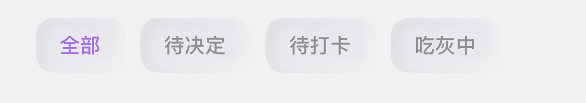

# MaiLeMe 首页筛选按钮下陷拟物实现

## 效果截图


## 问题
首页筛选按钮需要做到：

1. 保持一排轻量按钮，而不是厚重卡片；
2. 视觉上有“按进去”的下陷感；
3. 深浅色模式下都稳定，不要每个 tab 各写一套阴影逻辑。

## 实现思路
这套实现把职责拆开：

### 1. HomeTabBarView 只管文字、选中色和点击行为
真正的下陷效果不写在按钮内部，而是统一调用修饰器。

### 2. insetNeumorphic(cornerRadius:) 承载下陷式拟物效果
用双向模糊描边模拟：
- 右下偏黑的内阴影；
- 左上偏白的内高光；
- 中间铺一层动态底色。

## 可脱离项目独立保存的实现代码

```swift
import SwiftUI

/// 首页状态 Tab 条。
struct HomeTabBarView: View {
    @Binding var selectedTab: HomeTab

    var body: some View {
        ScrollView(.horizontal, showsIndicators: false) {
            HStack(spacing: 10) {
                ForEach(HomeTab.allCases) { tab in
                    Button {
                        selectedTab = tab
                    } label: {
                        Text(tab.title)
                            .font(.subheadline.weight(.semibold))
                            .foregroundStyle(
                                selectedTab == tab
                                ? Color(hex: "AE6DF2")
                                : Color(hex: "8E8E93")
                            )
                            .padding(.horizontal, 16)
                            .padding(.vertical, 10)
                            .background {
                                Color.clear.insetNeumorphic(cornerRadius: 12)
                            }
                    }
                    .buttonStyle(.plain)
                }
            }
        }
    }
}
```

```swift
import SwiftUI

extension View {
    /// 拟物化内凹样式（点击后的形态）。
    /// - Parameter cornerRadius: 圆角半径。
    func insetNeumorphic(cornerRadius: CGFloat = 16) -> some View {
        self.background {
            ZStack {
                Color.dynamicHex(light: "E9E9ED", dark: "151515")

                // 内凹阴影逻辑。
                RoundedRectangle(cornerRadius: cornerRadius, style: .continuous)
                    .stroke(
                        Color.dynamic(
                            light: Color(hex: "B4B4BE").opacity(0.5),
                            dark: Color.black.opacity(0.8)
                        ),
                        lineWidth: 4
                    )
                    .blur(radius: 4)
                    .offset(x: 2, y: 2)
                    .mask(
                        RoundedRectangle(cornerRadius: cornerRadius, style: .continuous)
                            .fill(
                                LinearGradient(
                                    gradient: Gradient(colors: [.black, .clear]),
                                    startPoint: .topLeading,
                                    endPoint: .bottomTrailing
                                )
                            )
                    )

                RoundedRectangle(cornerRadius: cornerRadius, style: .continuous)
                    .stroke(
                        Color.dynamic(light: .white.opacity(0.9), dark: .white.opacity(0.1)),
                        lineWidth: 4
                    )
                    .blur(radius: 4)
                    .offset(x: -2, y: -2)
                    .mask(
                        RoundedRectangle(cornerRadius: cornerRadius, style: .continuous)
                            .fill(
                                LinearGradient(
                                    gradient: Gradient(colors: [.clear, .black]),
                                    startPoint: .topLeading,
                                    endPoint: .bottomTrailing
                                )
                            )
                    )
            }
        }
        .clipShape(RoundedRectangle(cornerRadius: cornerRadius, style: .continuous))
    }
}
```

## 关键约束
- 按钮内部只保留文字和选中色；
- 下陷样式统一由 `insetNeumorphic` 提供；
- 圆角建议 12；
- 动态底色建议浅色 `E9E9ED`、深色 `151515`。

## 适用场景
- 顶部筛选 chips / tab pills；
- 轻量状态切换按钮；
- 浅灰 / 深灰软拟物页面中的分段控制器。
